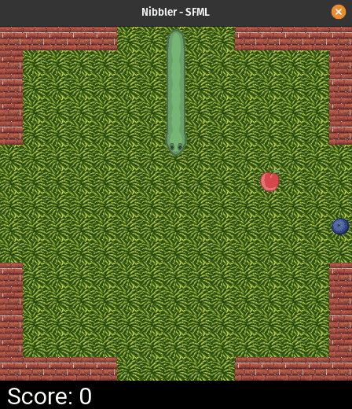
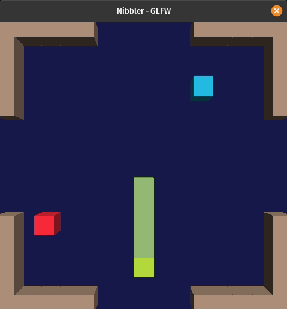
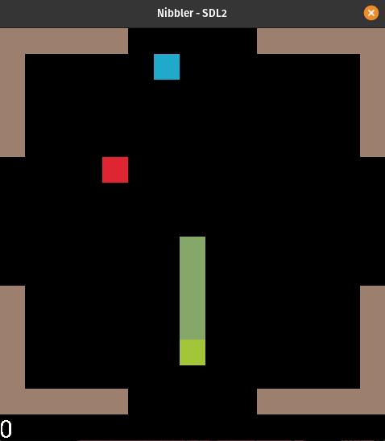

# nibbler

A project made within the 42 cursus.

## Presentation

A snake game that load dynamique library to change the rendering at runtime.  

## Control

<kbd>w</kbd>, <kbd>a</kbd>, <kbd>s</kbd>, <kbd>d</kbd> to change direction.  
<kbd>1</kbd>, <kbd>2</kbd>, <kbd>3</kbd> to change the rendering lib.  
<kbd>space</kbd> to quit.  

## Compilation an run

On linux `make` should install all dependencies and build the project.

Then launch with `./nibbler 1 15 15`.  

